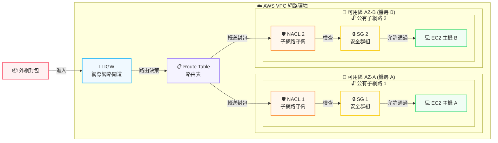

# AI Agent 與 AWS 雲端架構實戰

# 🚀 學習筆記：AI Agent 與 AWS 雲端架構實戰

## 📌 TOPIC 1: 雲端網路架構與 VPC 設計

> **核心概念**：網路設計、多網路串接、高併發處理 (GCP/AWS)
> 

### 🏗️ VPC 封包闖關標準流程

封包從外網進入 EC2 的生命週期與防線：

1. **外網封包** ➔ 2. **IGW (網際網路閘道)** ➔ 3. **Route Table (路由表)** ➔ 4. **NACL (子網路級守衛)** ➔ 5. **SG (安全群組)** ➔ 6. **EC2 (目的地)**

### 🛠️ AWS VPC 跨可用區 (AZ) 實戰建置步驟

- **Step 1: 建立基礎大門**
    - Create VPC (建立虛擬私有雲)。
    - 設立 IGW 並綁定到該 VPC。
    - 設定主要 Route Table，將 `0.0.0.0/0` 關聯並指向 IGW。
- **Step 2: 建立公有網段 (Public Subnets)**
    - 在**不同的 AZ** (可用區) 建立兩個公有網段 (達成高可用性)。
    - 將這兩個公有網段關聯到「有指向 IGW」的 Route Table。
- **Step 3: 建立私有網段 (Private Subnets)**
    - 建立一個**全新的 Route Table** (絕對不要指向外網)。
    - 再建立兩個私有網段 (同樣分散於不同 AZ)。
    - 將這兩個私有網段關聯到這個「沒有指向外面」的新 Route Table，完成內外網物理隔離。

## 📌 TOPIC 2: AWS Bedrock 與底層 AI 模型技術

> **核心概念**：大語言模型、向量化、知識檢索
> 

### 🧠 模型與基礎設定

- **AWS Bedrock 模型目錄**：使用 AWS 提供的模型前，必須先完成註冊與申請 (Submit Use Case Detail)。
- **Cohere 多語言模型**：適合處理多國語言任務的強大模型。

### 📐 向量與檢索技術 (RAG 核心)

- **Embedding Module (嵌入模組)**：負責將自然語言轉換成「數學向量 (AI Vector)」。
- **💡 重點觀念**：**「數學向量是電腦唯一聽得懂的語言」**。
- **Rerank (重新排序)**：在知識檢索後，利用 Rerank 技術將 Memory 裡或檢索出的資訊進行重要度排序，確保 AI 看到的是最精準的資料。

## 📌 TOPIC 3: AI Agent 核心機制 (Workflow, Memory, Guardrail)

> **核心概念**：打造具備記憶、邏輯與安全防護的自動化智能體
> 

### 🧠 關於 AI Agent Memory (記憶機制)

- **行為記憶**：Dify 聊天流中可設定要保留「前幾個對話」作為上下文記憶。
- **變數記憶與分配器**：
    - 擷取對話中重要的點並「變數化」儲存起來。
    - 包含：對話變數、輸出變數。
    - 透過配置標題欄位與描述，賦予 Agent 清晰的**身分概念**與**結構化**記憶。

### ⚙️ 關於 AI Agent Flow (工作流設計)

- **Workflow 基本結構**：透過「卡牌 (節點)」與「變數」串接。
    - `開始節點 (設定變數)` ➔ `中間處理節點` ➔ `結束節點 (輸出變數)`
- **精準輸出設計邏輯**：
    - `開始節點` (定義名稱、字數限制等條件) ➔ `知識檢索` (查詢文字) ➔ `LLM 節點` (配置 System/User Prompt) ➔ `輸出節點` (輸出變數)。
    - **目的**：加入「知識檢索」與「變數限制」，可有效避免 AI 回答不夠精準或產生幻覺。

### 🔀 關於 AI Agent 邏輯判斷

- **問題分類器 (Question Classifier)**：判斷使用者的意圖並決定後續 Workflow 走向。
- **參數提取器 (Parameter Extractor)**：從自然語言中精準抓取 API 所需的特定參數。
- **Grounding (事實查核)**：確保 AI 的回答基於真實數據，並能透過 HTTPS 與外部世界進行互動。

### 🛡️ 關於 AI Agent Guardrail (安全把關)

- **主要任務**：阻擋惡意攻擊與失控行為。
- **Prompt Injection (提示詞注入)**：防範使用者使用惡意提示詞 (例如：忘記先前指令、略過安全檢查) 導致 AI Agent 出錯或外洩機密。

## 📌 TOPIC 4: MCP (Model Context Protocol) 協議

> **核心概念**：AI 呼叫外部工具的通用標準協定
> 

### 🔌 MCP 運作邏輯與架構

- **定義**：MCP 就像是「API 規則手冊」，將呼叫邏輯做成獨立的伺服器，讓 AI 靠伺服器去自動調度第三方資源。
- **架構連線順序**：
`MCP Config` ➔ `MCP Server (統整與伺服器端)` ➔ `MCP Platform` ➔ `MCP Client (AI 客戶端)`

### 🛠️ 實戰應用與生態系

- **實現目標**：**「用 AI 直接操作雲端服務與外部軟體」**。
- **AWS MCP**：AWS S3 等雲端服務皆可成為 MCP 的其中一個功能節點。
    - *(參考資料：[AWS MCP Server is now generally available](https://aws.amazon.com/tw/blogs/aws/the-aws-mcp-server-is-now-generally-available/))*
- **Composio MCP**：
    - 一個強大的現成 MCP 平台，可直接作為 MCP Server 使用。
    - **應用場景**：串接後，可讓 AI Agent 擁有讀取私人郵件、甚至幫忙回信或做出反應動作的超能力。

